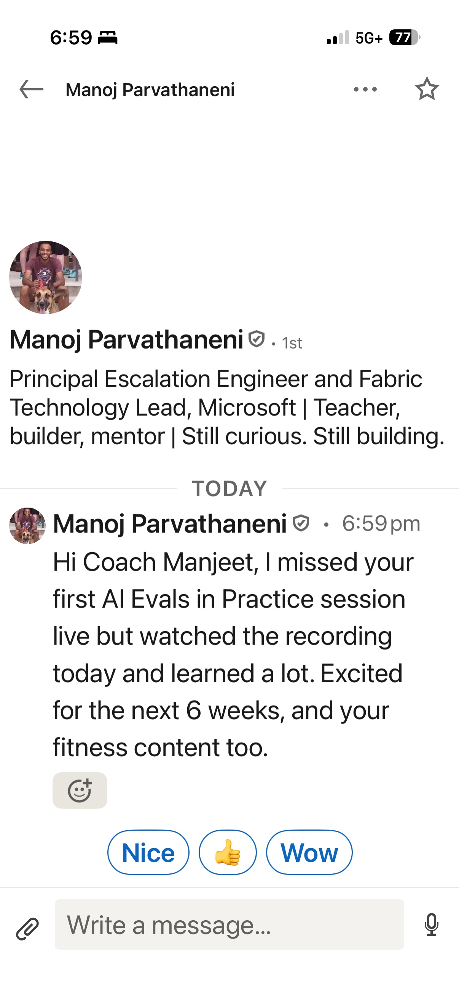

# Wall of Love — AI Evals in Practice

Real feedback from students, readers, and viewers. New entries go at the top
of their section, newest first.

**How to add:** drop a screenshot in `screenshots/` (named
`YYYY-MM-DD-source-brief-label.png`, e.g. `2026-10-08-bytebytego-sriram-prd-question.png`)
and add the entry below with a one-line caption. Keep the person's words verbatim;
never edit quotes.

---

## Course students

<!--
Format per entry:

### [Name] — [context, e.g. ByteByteGo student, Week 2]
> Verbatim quote or paraphrase clearly marked as such.

-->

## Course students

### Manoj Parvathaneni — ByteByteGo student, AI Evals in Practice
Principal Escalation Engineer and Fabric Technology Lead, Microsoft

> "Hi Coach Manjeet, I missed your first AI Evals in Practice session live but watched the recording today and learned a lot. Excited for the next 6 weeks, and your fitness content too."

## Content viewers & readers

*No entries yet.*

## Coaching clients

*No entries yet.*
