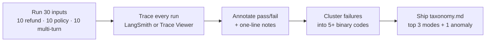

# Week 1 — Eval Foundations & Error Analysis

Why AI products need evals, the six quality dimensions, and the error-analysis
workflow that turns production failures into datasets.

> **Two paths through this week's hands-on work — pick one, both are legitimate.**
> **Path A — LangSmith** (recommended for engineers): follow the assignment steps
> below. Needs a `LANGSMITH_API_KEY` in your `.env`; traces land in the
> `ai-evals-course` project where you annotate them.
> **Path B — Trace Viewer** (zero setup): open the
> [Trace Viewer](https://coachmanjeet.github.io/AI-Agent-Evals-Course/trace-viewer/),
> click "Load the Pronto sample", and annotate traces right in your browser —
> no keys, no installs. Re-run the 6 sample traces a few times (or upload your
> own OTel JSON), then export your annotations as JSON/CSV — that's your
> `annotations.csv` equivalent for Assignment 1.

## This week's workflow

## Before you begin — 2 questions

Answer these now and keep your answers (pick a codename so it's anonymous but
yours). The same two questions come back in Week 6.

1. **On a scale of 1–10**, how confident are you that you could design an
   evaluation that tells you whether your AI feature is actually ready to ship?
2. **Scenario:** your AI agent demos beautifully, but real users keep complaining.
   What's your first move?

## What we covered

- Production failure case studies: how AI products actually break in the wild
- Model benchmarks vs. product evals (benchmarks don't measure your product)
- Non-determinism and how to approach it
- Traditional QA vs. AI evals; evals as core infrastructure
- The six quality dimensions: model quality, product behavior, safety, reliability, cost, latency
- Cost metrics: per-task cost tracking, token and retry accounting
- Latency metrics: time-to-first-token, span timing, percentile tracking
- Eval harness architecture and pipeline components
- Built a real customer-service agent (`agent/`) with logging and observability
- Traces vs. logs; the error-analysis workflow; failure taxonomies
- Frequency-based prioritization
- The eval flywheel: deploy → analyze → build dataset → improve → monitor

## Key takeaways

1. **Benchmarks measure models; evals measure your product.** A high MMLU score tells you nothing about your agent's refund flow.
2. **You can't improve what you can't see.** Tracing every run is the prerequisite for everything else in this course.
3. **Fix by frequency, not by loudness.** Failure taxonomies with counts beat anecdote-driven debugging.
4. **The flywheel is the product.** Deploy → analyze → dataset → improve → monitor is a loop, not a phase.

## Links

- LangSmith docs — tracing, datasets, annotation: https://docs.langchain.com/langsmith
- LangSmith concepts (traces, spans, runs): https://docs.langchain.com/langsmith/observability-concepts

## Tool: Trace Viewer

**[Trace Viewer](https://coachmanjeet.github.io/AI-Agent-Evals-Course/trace-viewer/)** —
a static, in-browser OTel trace explorer built for this week's error-analysis
workflow. Upload any OTel trace JSON (OTLP `resourceSpans` or flat `spans`),
browse the span waterfall, inspect attributes/events, and annotate each trace
with a failure mode from the course taxonomy. Annotations auto-save in your
browser and export as JSON/CSV — the seed of the eval dataset you build in
later weeks. Ships with a 6-trace Pronto sample (5 failure modes + 1 clean
trace) so it works end-to-end with zero setup. No backend; nothing you upload
leaves your browser.

## In this folder

- `examples/` — worked examples from the live session (added after the session)
- `assignments/01-instrument-and-trace/` — wire up tracing, run 30 inputs, annotate traces
- `assignments/02-failure-taxonomy/` — cluster failures into codes, report top modes
