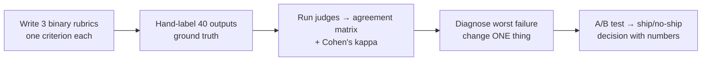

# Week 2 — Designing Reliable LLM Judges

When to trust an LLM to grade your agent, how to design judges that isolate
root causes, and how to validate them against human labels before they gate anything.

> **Tooling:** Braintrust is the default platform for this course — you get
> free access for the whole course, so there's no API key to buy and no
> separate model key needed (judge calls run on the course credit via
> Braintrust's proxy). Prefer LangSmith or another tool? Totally fine — the
> rubrics, agreement math, and trust gates below transfer unchanged.

## This week's workflow

## What we covered

- Evaluator types: code-based, traditional metrics, LLM-as-a-Judge, human eval
- Failure modes of traditional metrics (BLEU/ROUGE don't know what "correct" means here)
- Evaluator selection: accuracy, cost, and latency trade-offs
- Binary pass/fail rubrics vs. Likert scales
- Judge prompt anatomy: task, criteria, output format, examples
- Single-criterion judges for root-cause isolation (one judge per question)
- The four judge types: tone/style, factual correctness, instruction following, task completion
- Judge–human agreement matrices; false-pass vs. false-fail analysis
- Trust gates, false-pass rate, explainable failures
- Multi-turn and conversation-level evaluation
- Per-metric A/B evaluation

## Key takeaways

1. **One judge, one question.** A judge that scores "overall quality" can't tell you what broke. Split by criterion.
2. **Binary beats Likert for gating.** Pass/fail gives you a false-pass rate you can put a threshold on; a 3.7/5 doesn't.
3. **Validate against humans before trusting the judge.** Agreement matrices and Cohen's kappa are the receipt.
4. **False passes are the expensive error.** A judge that waves through bad outputs is worse than a strict one.

## Links

- Braintrust evals — datasets, scorers, `Eval()`, experiment view: https://www.braintrust.dev/docs/guides/evals
- Braintrust AI proxy (judge calls on course credit): https://www.braintrust.dev/docs/reference/proxy
- LangSmith evaluators (if you prefer LangSmith) — custom evaluators, `evaluate()`, experiments: https://docs.langchain.com/langsmith/evaluation

## In this folder

- `examples/` — worked examples from the live session (added after the session)
- `assignments/01-build-and-validate-judge/` — 3 binary rubrics as Braintrust scorers, validated on 40 labels
- `assignments/02-diagnose-and-compare/` — diagnose-and-fix cycle, prompt A/B, ship/no-ship decision

## Hands-on game

**[Judge Calibration Game](https://coachmanjeet.github.io/AI-Agent-Evals-Course/judge-calibration-game/)**
— the interactive companion for this week. Label 24 Pronto support responses
pass/fail, write a judge prompt, and watch your judge's agreement with your
labels scored live (accuracy, precision/recall, F1, Cohen's κ) — then check
your labels against the gold answer key. Paste your Braintrust API key (free
course credit), bring your own OpenAI/Anthropic key, or run the whole thing
in `?mock=1` test mode with no key. Source and docs:
`docs/judge-calibration-game/`.

> Requires GitHub Pages to be enabled on this repo (Settings → Pages →
> Deploy from a branch → `main` → `/docs`).
