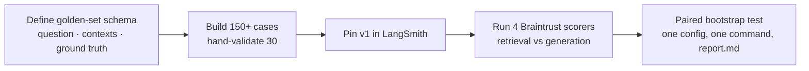

# Week 4 — RAG Evaluation

Retrieval-augmented generation fails in two places — retrieval and generation —
and your evals have to score them separately. This week is also where statistical
rigor enters: sample sizes, paired tests, and confidence intervals.

## This week's workflow

## What we covered

- Eval data: the four dataset qualities — representativeness, diversity, label correctness, versioning
- Golden-set schema; criteria-based ground truth
- Synthetic data generation and validation (and why synthetic labels need checking)
- Dataset versioning and pinning in LangSmith
- Benchmark literacy: MMLU, HumanEval, SWE-bench (what they measure, what they don't)
- Component-wise RAG evaluation: retrieval vs. generation
- The four RAG scorers (Braintrust): faithfulness, answer relevance, context precision, context recall
- Groundedness: is the answer supported by the retrieved context?
- Braintrust experiments: datasets, custom scorer functions, per-scorer means
- Sample size and margin of error; paired testing
- Bootstrap confidence intervals; significance testing and p-values
- Multiple comparisons and held-out re-testing
- Repeatable harness design: pinned datasets, one config, reproducible runs

## Key takeaways

1. **Score retrieval and generation separately.** A perfect generator can't save bad retrieval, and conflating the two hides which to fix.
2. **Groundedness is the RAG metric that matters most.** An unfaithful answer is a confident lie — worse than "I don't know."
3. **Small n lies.** Report confidence intervals, not point estimates; use paired tests when comparing variants on the same inputs.
4. **Pin everything.** Dataset version, config, model version — a harness you can't reproduce is a demo, not an eval.

## Links

- Braintrust docs — experiments, scorers, autoevals: https://www.braintrust.dev/docs
- LangSmith datasets & versioning: https://docs.langchain.com/langsmith

## Setup — Braintrust key (free tier)

1. Sign up at [braintrust.dev](https://www.braintrust.dev) (free tier is plenty for this course).
2. Create an API key and add it to your `.env`: `BRAINTRUST_API_KEY=<paste your key>`.
3. `pip install braintrust` in your `.venv`.

## In this folder

- `examples/` — worked examples from the live session (added after the session)
- `assignments/01-build-and-version-dataset/` — 150+ case golden set, pinned v1
- `assignments/02-measure-and-test/` — Braintrust scorers, groundedness failure, bootstrap test
