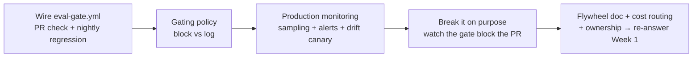

# Week 6 — Production Eval Infrastructure

Everything so far was practice. This week the evals move into production:
gates in CI, monitoring online, and an operating cadence with a named owner.

## This week's workflow

## What we covered

- Eval checkpoints: PR check, nightly regression, pre-launch gate
- Eval gates in GitHub Actions (this repo has a starter: `.github/workflows/eval-gate.yml`)
- Gating policy: blocking vs. logged metrics
- Decision gates: turning eval numbers into ship / no-ship product calls
- Threshold-setting from business impact: which metric moves which dollar
- Fix prioritization: failure frequency × business cost (the Week 1 taxonomy, now priced)
- The decision memo: what shipped, what didn't, what gets fixed first and why
- Fast PR subsets vs. full regression suites
- Online evaluation signals; traffic sampling for eval cost control
- Alerting policy: what pages, what waits for morning
- The drift taxonomy: data drift, concept drift, prompt/model drift
- Scheduled canary evaluation
- Compounding eval: the eval flywheel, from production failures to regression tests
- Eval-driven model routing and cost optimization
- Ownership and operating cadence

## Key takeaways

1. **Gate the merge, not just the deploy.** A PR check that runs the fast eval subset catches regressions when they're cheapest to fix.
2. **Blocking vs. logged is a policy decision.** Block on safety and correctness; log (don't block) on exploratory metrics — or every team learns to bypass the gate.
3. **Production is a new eval surface.** Drift, canaries, and traffic sampling are evals too — they just run on live data.
4. **Evals compound.** Every incident becomes a regression test; every regression test makes the next incident cheaper. That flywheel needs an owner and a cadence, or it stops.
5. **Evals end in decisions, not dashboards.** A measurement gate gives you the number; the decision memo says what ships. Set thresholds from business impact and prioritize fixes by frequency × cost — never by loudness.

## Decision gates — from eval numbers to product calls

A measurement gate tells you the score. A decision gate tells you what to do:

| Eval result | Decision | Why |
|---|---|---|
| Refund correctness 96% (target 95%) | SHIP | Above bar; log the 4% misses into the gold set |
| Escalation correctness 84% (target 90%) | SHIP WITH CONDITIONS | Ship, but the $50-cap misses become P0 fixes this sprint — each miss is unapproved revenue leaving the building |
| Hallucination rate 0.4% (target 0%) | NO-SHIP for auto-refunds | Any hallucinated order ID is a wrong-customer refund; the gate stays red until 0% on the regression set |

Rules of thumb:

- **Set every threshold from a business number, not a vibe.** "95% refund correctness" exists because 5% wrong at Pronto's ticket volume costs real money each month — write the dollar figure next to the threshold.
- **Prioritize fixes by frequency × business cost.** The Week 1 taxonomy gave you frequency; multiply by cost per incident. The top of that ranked list is your sprint plan.
- **Write the decision memo.** One page: what the evals said, what shipped, what didn't, what's fixed first and why. This is the artifact your stakeholders actually read — it's also how you demonstrate the business value of the eval work itself.

## Links

- GitHub Actions docs — workflows, schedules: https://docs.github.com/actions
- LangSmith docs — monitoring and automations: https://docs.langchain.com/langsmith

## In this folder

- `examples/` — worked examples from the live session (added after the session)
- `assignments/01-deploy-the-infrastructure/` — GitHub Actions gates + monitoring + canary
- `assignments/02-operate-and-document/` — flywheel cycle doc, cost-routing recommendation, ownership doc
- `resources/` — production references, Pronto-flavored for this course

## Production resources

Read these alongside the assignments — they cover operating Pronto, while the
assignments cover wiring the eval infrastructure:

- [`resources/pronto-production-readiness-checklist.md`](resources/pronto-production-readiness-checklist.md) —
  the pre-launch bar: hard requirements that block ship, plus the 30/90-day
  backlog and a launch dry-run. Use after Assignment 1.
- [`resources/pronto-metrics-catalog.md`](resources/pronto-metrics-catalog.md) —
  which metrics to emit (10-metric starter set in bold), including
  Pronto-specific refund and escalation metrics. Use when defining Assignment
  1's monitoring signals.
- [`resources/pronto-incident-response-playbook.md`](resources/pronto-incident-response-playbook.md) —
  the on-call runbook: first-5-minutes procedure plus 7 Pronto scenarios
  (refund runaway, prompt-injection wave, order-lookup failure…). Use when
  writing Assignment 2's 2-AM playbook.
- [`resources/pronto-rca-template.md`](resources/pronto-rca-template.md) —
  the full postmortem template (blameless). Use when Assignment 2's flywheel
  cycle deserves more than the short template.

## Close the loop

Dig out your Week 1 answers (the 1–10 confidence score and the "demos beautifully,
users complain" scenario — you kept them under your codename, right?). Answer both
again, then compare. That delta is what the last six weeks bought you.
